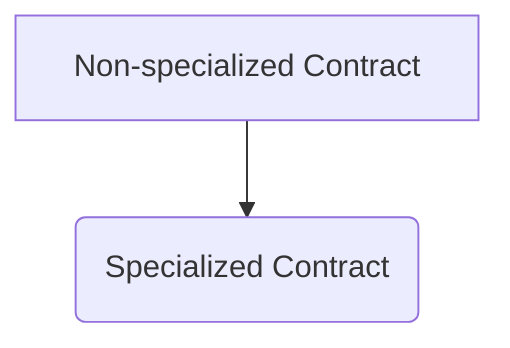
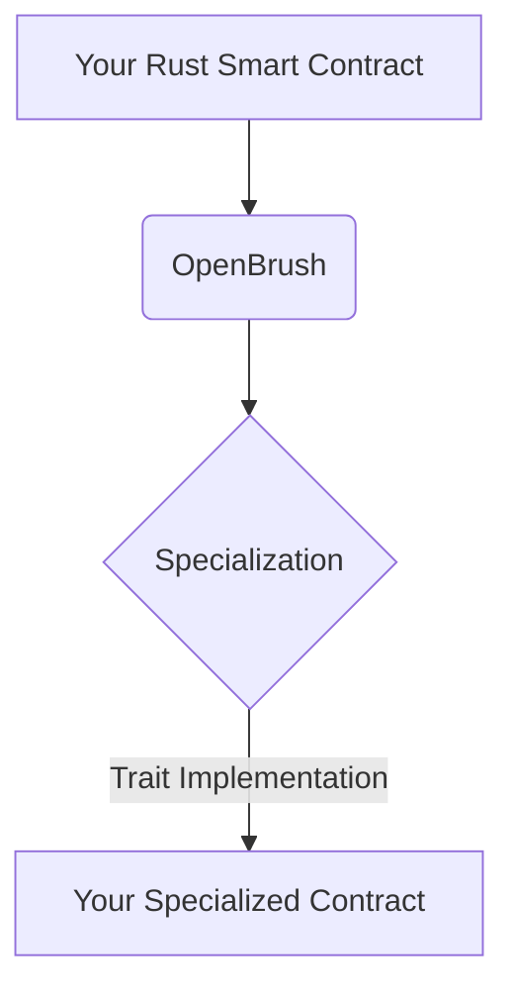

import Svg from './image.svg';

<Svg />

If you're developing smart contracts on the Substrate framework, you might be interested in the OpenBrush library, which provides a set of reusable modules and traits for specialized contract development. In this article, we'll cover the basics of how to import and use OpenBrush in your project.

### Getting Started

OpenBrush uses ink! version `4.0.0` at the moment, so you will need to use the same version of ink! in your project. If you use a different version of ink, you need to use a different version of OpenBrush which uses the same version of ink!. OpenBrush had several significant changes in API, so you check the [Wizard](https://openbrush.io) to study how to use different versions of OpenBrush.

The OpenBrush library provides default implementations of traits that can be enabled via crate features. A list of all available features can be found [here](https://github.com/727-Ventures/openbrush-contracts/blob/main/Cargo.toml#L51). The default implementation of traits requires the usage of the unstable feature [min-specialization](https://doc.rust-lang.org/beta/unstable-book/language-features/min-specialization.html). You can enable it by adding `#![feature(min_specialization)]` at the top of your root module (for more information, check the [Rust official documentation](https://doc.rust-lang.org/rustdoc/unstable-features.html)).

By default, the `openbrush` crate provides macros for simplification of the development and traits of contracts. Some default implementations for traits provide additional methods that can be overridden. These methods are defined in a separate internal trait. If you want to override them, you need to do that in the `impl` section of the internal trait. If you imported several internal traits, you could specify which one you want to use, `psp22::Internal` or `psp34::Internal`.

Here is the default `toml` of your project with OpenBrush:

```toml
[dependencies]
# Import ink!
ink = { version = "4.1.0", default-features = false}

scale = { package = "parity-scale-codec", version = "3", default-features = false, features = ["derive"] }
scale-info = { version = "2.3", default-features = false, features = ["derive"], optional = true }

# Brush dependency
openbrush = { git = "https://github.com/727-Ventures/openbrush-contracts", version = "~3.0.0", default-features = false }

[features]
default = ["std"]
std = [
  "ink/std",
  "scale/std",
  "scale-info/std",
  # Brush dependency
  "openbrush/std",
]
ink-as-dependency = []
```

> **_Note:_** ink! requires putting `#![cfg_attr(not(feature = "std"), no_std)]` at the top of the root crate.

### Reusing Implementation of Traits from OpenBrush

To use the OpenBrush library, you'll first need to enable the corresponding feature in your `Cargo.toml`. The name of the feature is the same as the name of the module. For example, to enable `psp22`:

```toml
openbrush = { git = "https://github.com/727-Ventures/openbrush-contracts", version = "~3.0.0", default-features = false, features = ["psp22
```

## Diagrams

Here is a diagram that shows the difference between a non-specialized contract and a specialized contract:



And here is a diagram that shows how OpenBrush can be used in your project:



### Conclusion

In this article, we covered the basics of using the OpenBrush library for specialized contract development in Rust. We discussed how to import and use OpenBrush in your project, how to enable the corresponding features, and how to reuse implementations of traits from OpenBrush.

By using OpenBrush, you can save time and effort when developing specialized contracts. It provides a set of reusable modules and traits that can simplify your development process and make your code more concise and readable. With OpenBrush, you can easily create specialized contracts that are tailored to your specific use case.

If you're interested in learning more about OpenBrush, you can check out the [official documentation](https://learn.brushfam.io/docs/openbrush).
