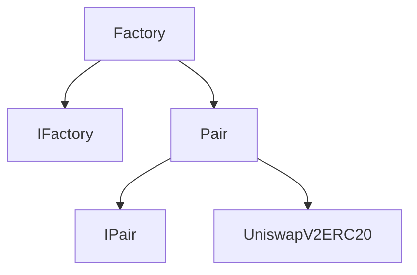

Uniswap V2 is a decentralized exchange protocol built on the Ethereum blockchain, enabling users to trade cryptocurrencies without the need for a centralized intermediary. In this article, we'll focus on the two core components of UniswapV2: the Factory and the Pair.

The Factory is responsible for managing pairs and creating new ones. It contains a mapping of all pairs, enabling easy retrieval and management of existing pairs. The Factory deploys instances of the Pair contract to create new pairs. The Factory also sets the fee recipient and fee setter addresses, which determine where fees from trades are sent and who is authorized to modify the fee.

The Pair contract manages liquidity for a particular pair, storing pair-specific data like reserve amounts, timestamps, and accumulated price. It handles token transfers during swaps, minting, and burning of liquidity. The Pair implements the IPair interface and extends the UniswapV2ERC20 contract, which ensures compatibility with other ERC20 tokens and other Pair contracts.

The following table provides a side-by-side comparison of the functionalities of the Factory and the Pair:

| Factory                                               | Pair                                                                                        |
| ----------------------------------------------------- | ------------------------------------------------------------------------------------------- |
| Manages pairs and pair creation                       | Manages liquidity pool for a pair                                                           |
| Contains a mapping of all pairs                       | Stores pair-specific data like reserve amounts, timestamps, and accumulated price           |
| Creates pairs by deploying instances of Pair contract | Calculates fees and handles token transfers during swaps, minting, and burning of liquidity |
| Sets the fee recipient and fee setter addresses       | Implements IPair interface and extends UniswapV2ERC20 contract                              |
| Implements IFactory interface                         | Implements \_mintFee, \_safeTransfer, and \_update functions                                |
|                                                       | Implements swap, mint, burn, skim, and sync functions                                       |

The diagram below illustrates the relationship between the Factory and the Pair:

In conclusion, Uniswap V2 provides a decentralized and trustless platform for trading cryptocurrencies. The Factory and Pair are two key components that work together to enable the creation and management of pairs, as well as the handling of liquidity and token transfers.
