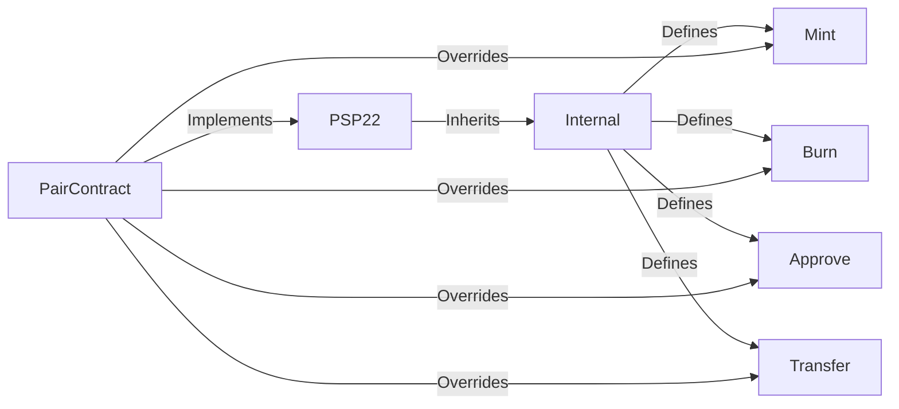

import Svg from './ink.svg';

<Svg style={{ width: '100%', height: '300px' }} />

# Step-by-Step Guide: Implementing PSP22 for Pair Contract

In this guide, we will learn how to implement the PSP22 standard for the Pair contract in Rust. The Pair contract is a slightly modified ERC-20 contract that doesn't decrease allowance when tokens are transferred. We will use the OpenBrush implementation of PSP22, and we will override some of its functions to match the Pair contract's functionality. We will also add events to the contract.

## Prerequisites

Before we start, make sure you have the following installed on your machine:

- Rust
- Cargo
- ink!

## Step 1: Importing Required Crates

In the `Cargo.toml` file, add the following dependencies:

```toml
[dependencies]
ink = { version = "4.0.0", default-features = false }
scale = { package = "parity-scale-codec", version = "3", default-features = false, features = ["derive"] }
scale-info = { version = "2.3", default-features = false, features = ["derive"], optional = true }
openbrush = { git = "https://github.com/727-Ventures/openbrush-contracts", version = "3.0.0", default-features = false, features = ["psp22"] }
```

Next, in the `lib.rs` file, add the following imports:

```rust
use ink::{
    codegen::{
        EmitEvent,
        Env,
    },
    traits::{
        Storage,
        SpreadAllocate,
    },
};
use ink::prelude::vec::Vec;

use openbrush::{
    contracts::{
        psp22::{
            Internal,
            PSP22,
            PSP22Error,
        },
    },
};
```

## Step 2: Adding the Storage Struct and Implementing PSP22

Add the following storage struct to your contract:

```rust
#[ink(storage)]
#[derive(Default, Storage)]
pub struct PairContract {
    #[storage_field]
    psp22: psp22::Data,
}
```

Next, implement the PSP22 trait into your contract struct:

```rust
impl PSP22 for PairContract {}
```

Add an `impl` block for the contract and add the constructor:

```rust
impl PairContract {
    #[ink(constructor)]
    pub fn new() -> Self {
        Self { psp22: Default::default() }
    }
}
```

Your contract should now look like this:

```rust
#![cfg_attr(not(feature = "std"), no_std)]
#![feature(min_specialization)]

#[ink(storage)]
#[derive(Default, Storage)]
pub struct PairContract {
    #[storage_field]
    psp22: psp22::Data,
}

impl PSP22 for PairContract {}

impl PairContract {
    #[ink(constructor)]
    pub fn new() -> Self {
        Self { psp22: Default::default() }
    }
}
```

## Step 3: Adding Events

We need to add events to the contract. We will add the `Transfer` and `Approval` events to the contract. Add the following events struct to your contract:

```rust
#[ink(event)]
pub struct Transfer {
    #[ink(topic)]
    from: Option<AccountId>,
    #[ink(topic)]
    to: Option<AccountId>,
    value: Balance,
}

#[ink(event)]
pub struct Approval {
    #[ink(topic)]
    owner: AccountId,
    #[ink(topic)]
    spender: AccountId,
    value: Balance,
}
```

Next, we need to override the event emitting methods of the PSP22 Internal trait. Add the following implementation block to your contract:

```rust
impl Internal for PairContract {
    fn _emit_transfer_event(
        &self,
        from: Option<AccountId>,
        to: Option<AccountId>,
        value: Balance,
    ) {
        self.env().emit_event(Transfer { from, to, value });
    }

    fn _emit_approval_event(
        &self,
        owner: AccountId,
        spender: AccountId,
        value: Balance,
    ) {
        self.env().emit_event(Approval { owner, spender, value });
    }
}
```

We are overriding the `_emit_transfer_event` and `_emit_approval_event` methods to emit the `Transfer` and `Approval` events respectively. These methods are called by the PSP22 trait when tokens are transferred or approved.

With this step, we have successfully added events to our contract and overridden some of the default behavior of the PSP22 standard.

We can now move on to the next step, where we will create a mermaid diagram to visualize the relationship between Pair contract, PSP22, and its methods, as well as a table summarizing the PSP22 methods and their descriptions.

Let's create a mermaid diagram to illustrate the relationship between Pair contract, PSP22, and its methods.



---

PSP22 methods:

| Method          | Description                                                         |
| --------------- | ------------------------------------------------------------------- |
| `total_supply`  | Returns the total supply of the token                               |
| `balance_of`    | Returns the balance of a given account                              |
| `allowance`     | Returns the amount of tokens approved for a spender                 |
| `transfer`      | Transfers tokens from sender to recipient                           |
| `approve`       | Approves a spender to spend tokens on behalf of sender              |
| `transfer_from` | Transfers tokens from a given sender to a recipient, given approval |
| `burn`          | Destroys tokens from sender's account                               |
| `mint`          | Creates new tokens and adds them to sender's account                |

## Conclusion

Congratulations! You have successfully implemented PSP22 in your Pair contract, added events, and overrode its default implementation.

With this guide, you should be able to implement PSP22 in your own contracts and customize its default behavior to fit your specific use case.
