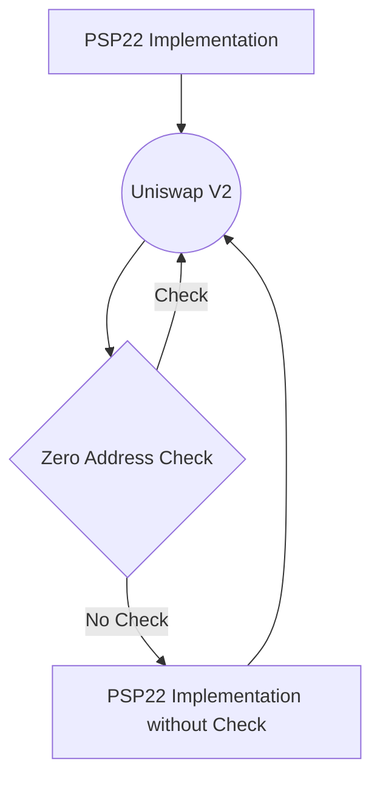

import Svg from './ink.svg';

<Svg
  style={{
    width: '100%',
    height: '400px',
    color: 'black',
    padding: '20px',
    background:
      'linear-gradient(93.06deg, rgb(255, 0, 199) 2.66%, rgb(255, 159, 251) 98.99%)',
  }}
/>

Uniswap is a decentralized exchange (DEX) that allows users to swap various cryptocurrencies without the need for an intermediary.

Uniswap V2, the second iteration of the protocol, introduced several new features and improvements over its predecessor, including flash swaps and a more efficient pricing model. However, one particular feature of Uniswap V2 has caused some confusion and challenges for developers: the use of the zero address.

This poses a problem for PSP22 implementation as it has a built-in check for a zero account in mint, burn, transfer_from, and approve functions. However, this can be overcome by overriding the generic implementation of PSP22 functions for Uniswap V2 integration.

By removing the check for the zero address in PSP22 functions, we can create a new implementation of the functions that can work seamlessly with Uniswap V2. In this way, Uniswap V2 can use the zero address to lock tokens, and the PSP22 implementation can work without any issues.



The overridden functions can be implemented in the PairContract in the following way:

```rust
impl Internal for PairContract {
    fn _mint_to(&mut self, account: AccountId, amount: Balance) -> Result<(), PSP22Error> {
        let mut new_balance = self._balance_of(&account);
        new_balance += amount;
        self.psp22.balances.insert(&account, &new_balance);
        self.psp22.supply += amount;
        self._emit_transfer_event(None, Some(account), amount);
        Ok(())
    }

    fn _burn_from(&mut self, account: AccountId, amount: Balance) -> Result<(), PSP22Error> {
        let mut from_balance = self._balance_of(&account);

        if from_balance < amount {
            return Err(PSP22Error::InsufficientBalance)
        }

        from_balance -= amount;
        self.psp22.balances.insert(&account, &from_balance);
        self.psp22.supply -= amount;
        self._emit_transfer_event(Some(account), None, amount);
        Ok(())
    }

    fn _approve_from_to(
        &mut self,
        owner: AccountId,
        spender: AccountId,
        amount: Balance,
    ) -> Result<(), PSP22Error> {
        self.psp22.allowances.insert(&(&owner, &spender), &amount);
        self._emit_approval_event(owner, spender, amount);
        Ok(())
    }

    fn _transfer_from_to(
        &mut self,
        from: AccountId,
        to: AccountId,
        amount: Balance,
        _data: Vec<u8>,
    ) -> Result<(), PSP22Error> {
        let from_balance = self._balance_of(&from);

        if from_balance < amount {
            return Err(PSP22Error::InsufficientBalance)
        }

        self.psp22.balances.insert(&from, &(from_balance - amount));
        let to_balance = self._balance_of(&to);
        self.psp22.balances.insert(&to, &(to_balance + amount));

        self._emit_transfer_event(Some(from), Some(to), amount);
        Ok(())
    }

```

By removing the check for the zero address, we can integrate PSP22 implementation with Uniswap V2 and leverage its locking feature without any issues.
