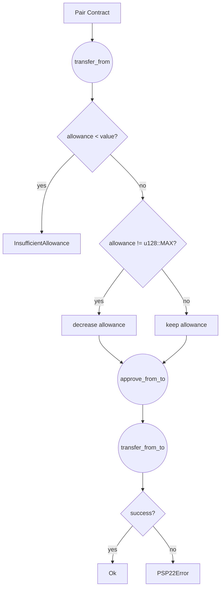

When working with the Uniswap V2 implementation, there are a few quirks that need to be taken into account.

One such quirk is the way that the `max allowance` is handled within the ERC-20 implementation.

Specifically, the `max allowance` will not decrease an allowance in Uniswap V2. In order to overcome this limitation, we need to override the `transfer_from` function and not decrease the allowance if it is already at the `u128::MAX` value.

To implement this override, we'll first need to make sure that we include the `#[ink(message)]` attribute in order to ensure that our code compiles correctly. Once that is done, we can add the following code block inside the existing `impl PSP22` block:

```rust
impl PSP22 for PairContract {
    #[ink(message)]
    fn transfer_from(
        &mut self,
        from: AccountId,
        to: AccountId,
        value: Balance,
        data: Vec<u8>,
    ) -> Result<(), PSP22Error> {
        let caller = self.env().caller();
        let allowance = self._allowance(&from, &caller);

        // In Uniswap V2 max allowance never decreases
        if allowance != u128::MAX {
            if allowance < value {
                return Err(PSP22Error::InsufficientAllowance)
            }

            self._approve_from_to(from, caller, allowance - value)?;
        }
        self._transfer_from_to(from, to, value, data)?;
        Ok(())
    }
}
```

Here we've simply added a check to the `allowance` value to see if it is already set to `u128::MAX`. If it is, we skip the step where we decrease the allowance value, and proceed directly to the `_transfer_from_to` function. If the `allowance` is less than `value`, we return an `InsufficientAllowance` error. Otherwise, we call the `_approve_from_to` function to decrease the allowance by `value` before calling the `_transfer_from_to` function as normal.

With this override in place, we can now properly handle the `max allowance` issue within the Uniswap V2 implementation. By taking advantage of the `#[ink(message)]` attribute and the existing `impl PSP22` block, we can add this functionality with minimal effort.

Below is a diagram illustrating the code changes required to override transfer_from in Uniswap V2 for the max allowance issue.



---

Conclusion

When working with the Uniswap V2 implementation, it's important to keep in mind the quirks and limitations of the platform. By taking advantage of the existing implementation and using overrides where necessary, we can create a more robust and effective implementation that works for our specific needs. The `max allowance` issue is just one example of the kinds of challenges that can arise when working with Uniswap V2, but with the right approach, these challenges can be overcome.
