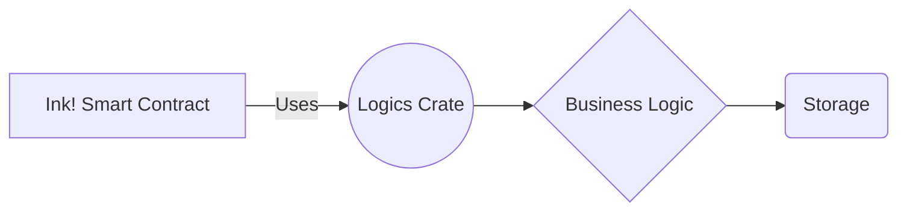

The `logics` crate is a tool that helps developers manage the business logic of their smart contracts in Ink!. It allows developers to organize and structure their smart contracts by separating the business logic from the contract's state and storage. This separation makes it easier to read, write, and test the code, making the development process more efficient and less error-prone.

Let's take a closer look at the `logics` crate and how it works.

## What is the `logics` crate?

The `logics` crate is a set of libraries and tools that help developers manage the business logic of their smart contracts in Ink!. It provides a standard structure for organizing and separating the business logic of the contract from the contract's state and storage.

The `logics` crate is built on top of Ink!, Substrate's smart contract language. It is designed to be easy to use and provides a high-level syntax that simplifies the process of managing the business logic of a smart contract.

The `logics` crate provides a set of pre-defined templates and structures that can be used to organize the business logic of a smart contract. It includes a set of traits and implementations that define the functionality of the contract and its components.

## How does the `logics` crate work?

The `logics` crate works by separating the business logic of the smart contract from its state and storage. This separation makes it easier to manage the code and allows developers to focus on the business logic of the contract, rather than the details of its implementation.

The `logics` crate provides a standard structure for organizing the business logic of a smart contract. It includes a set of traits and implementations that define the functionality of the contract and its components.

Developers can use the `logics` crate to define the functionality of their smart contract by creating a set of traits that define the functionality of the contract. These traits can be implemented by various components of the smart contract, such as its storage and state.

The `logics` crate provides a set of pre-defined templates and structures that can be used to organize the business logic of a smart contract. These templates include the Pair template, which is used to manage pairs of tokens in a decentralized exchange, and the Factory template, which is used to manage the creation and deployment of new contracts.

## Advantages of using the `logics` crate

The `logics` crate provides several advantages for developers building smart contracts in Ink!. These advantages include:

- Easy to use: The `logics` crate provides a high-level and easy-to-use syntax that simplifies the process of managing the business logic of a smart contract.
- Standard structure: The `logics` crate provides a standard structure for organizing the business logic of a smart contract, making it easier to read, write, and test the code.
- Reusability: The `logics` crate provides a set of pre-defined templates and structures that can be used to organize the business logic of a smart contract. This makes it easier to reuse code across different contracts and projects.
- Modularity: The `logics` crate allows developers to separate the business logic of the smart contract from its state and storage. This makes it easier to manage the code and allows developers to focus on the business logic of the contract, rather than the details of its implementation.
