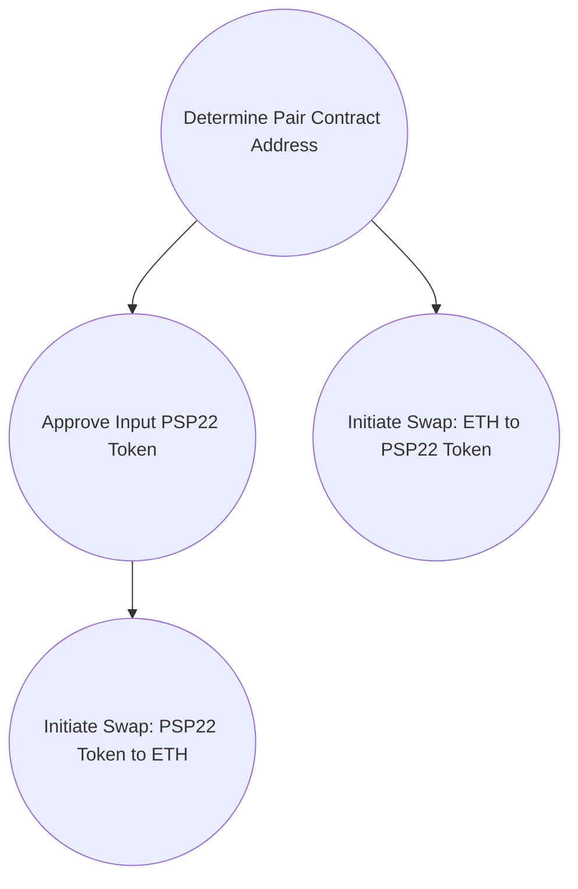

import Svg from './rust.svg';

<Svg
  style={{
    width: '100%',
    height: '500px',
  }}
/>

Token swapping is a fundamental operation in decentralized exchanges (DEXs) that allows users to exchange one token for another seamlessly.

In this article, we will dive into the implementation of token swaps in ink! smart contracts, incorporating insights from the [Understanding Storage Fields in ink! Smart Contracts](https://uniswap-v2-dex.blog/blog/storage-fields) article. By following the steps outlined here, you'll gain a thorough understanding of how to facilitate efficient and secure token swaps in your ink! projects.

Token Swaps Overview:
Token swaps involve exchanging one token for another within a specific pair. Let's consider the example of swapping tokens between ETH and a PSP22 token.

1. ETH to PSP22 Token Swap:
   To swap ETH for a PSP22 token, we need to follow these steps:

Step 1: Determine the Pair Contract Address
Retrieve the pair contract address from the storage fields implementation.

Step 2: Initiate the Swap
Send the desired amount of ETH to the pair contract address and specify the PSP22 token to receive in return.

2. PSP22 Token to ETH Swap:
   To swap a PSP22 token for ETH, the following steps are required:

Step 1: Determine the Pair Contract Address
Retrieve the pair contract address from the storage fields implementation.

Step 2: Approve the Input PSP22 Token
Prior approval is necessary to enable the callee contract to spend the caller's PSP22 tokens.

Step 3: Initiate the Swap
Call the swap function by providing the input PSP22 token amount and specifying ETH as the desired output.

Implementing the Storage Fields:
Successful token swaps rely on correctly implementing the required storage fields. These fields include:

- Factory: The contract address of the factory.
- Token0: The address of token0 (ETH).
- Token1: The address of token1 (PSP22 token).
- Reserve0: The reserve amount of token0 (ETH).
- Reserve1: The reserve amount of token1 (PSP22 token).
- BlockTimestampLast: The timestamp of the most recent block.
- Price0CumulativeLast: The cumulative price of token0 (ETH).
- Price1CumulativeLast: The cumulative price of token1 (PSP22 token).
- KLast: The product of reserve0 and reserve1 as of the most recent liquidity event.

The ink! smart contract incorporates these storage fields in a structured manner, facilitating efficient data management during token swaps.

Below is a diagram illustrating the token swap process:

In the diagram, the steps for PSP22 token to ETH swaps are represented on the left side, while the ETH to PSP22 token swap steps are depicted on the right side. The "Determine Pair Contract Address" step is common to both swap types.

Conclusion:
Token swaps are vital for decentralized exchanges, enabling users to seamlessly trade one token for another. In this article, we explored the implementation of token swaps in ink! smart contracts, incorporating insights from the "Understanding Storage Fields in ink! Smart Contracts" article. By understanding the necessary steps and leveraging the appropriate storage fields, you can build robust and efficient token swap functionality in your ink! projects.
