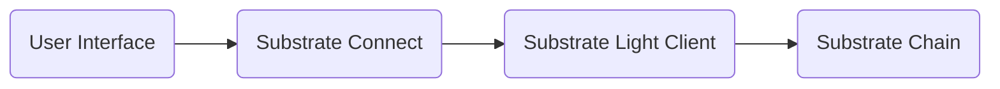

import Svg from './image.svg';

<Svg
  style={{
    width: '100%',
    height: '300px',
  }}
/>

Blockchain user interfaces have traditionally relied on centralized RPC nodes for communication with network nodes. However, Substrate Connect introduces a new paradigm by replacing RPC node reliance with light clients. In this article, we will delve into the concept of light clients and their significance in blockchain applications, with a specific focus on the Substrate framework and the ink! ecosystem.

Light clients provide a lightweight and decentralized approach to interact with blockchain networks. Unlike full nodes that require storing the entire blockchain, light clients verify block authenticity and fetch required data from trusted nodes. Benefits include reduced resource requirements, faster initialization, and improved security.

Substrate Connect is a JavaScript library and browser extension that enables the creation of application-specific light clients for Substrate chains. It replaces RPC node reliance, allowing developers to synchronize applications with the blockchain by defining the chain specification. This eliminates the need for node installation or maintenance.

#### Benefits of Substrate Connect

- Decentralization: Light clients enable decentralized access to blockchain data.
- Security: Light clients validate block authenticity using cryptographic proofs.
- Simplified Setup: Substrate Connect eliminates the complexities of node installation and administration.

#### Utilizing Substrate Connect

Substrate Connect offers two methods for integration:

1. JavaScript Library:

   - Provides a bundled Substrate-compatible node through the PolkadotJS API.
   - Allows running a Substrate light client within a NodeJS environment.
   - Enables interaction with the blockchain network securely and efficiently.

2. Browser Extension:
   - Overcomes browser limitations on WebSockets from HTTPS pages.
   - Establishes a sufficient number of peers and keeps chains synchronized in the background.
   - Enhances application performance and user experience.

#### Interaction diagram:

#### Substrate vs. Substrate Connect

|                | Substrate (Full Node)                                   | Substrate Connect (Light Client)                    |
| -------------- | ------------------------------------------------------- | --------------------------------------------------- |
| Verification   | Full verification of all blocks                         | Verifies block authenticity only                    |
| Data Storage   | Stores previous block data and chain storage            | No database required                                |
| Installation   | Exhaustive and requires system administration expertise | No installation required; minimal or no maintenance |
| Initialization | Longer initialization time                              | Initializes in seconds                              |

#### Conclusion

Light clients, facilitated by Substrate Connect, revolutionize blockchain application interactions. By replacing RPC node reliance with lightweight and decentralized clients, developers can build applications that are secure, efficient, and user-friendly. With Substrate Connect, blockchain development in the ink! ecosystem becomes more accessible and powerful.

#### Resources:

- [Substrate Connect](https://wiki.polkadot.network/docs/build-substrate)
