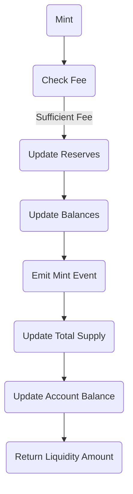

import Svg from './image.svg';

<Svg
  style={{
    width: '100%',
    height: '300px',
  }}
/>

In this article, we will continue our exploration of the Pair contract in ink! smart contracts and focus on implementing the mint functionality. Minting allows for the creation of liquidity in a pair contract. We will add the necessary functions to the Pair trait, including the mint function, internal functions for fee calculation and state update, and event emission.

## Pair Trait with Mint Functions

To begin, open the `./logics/traits/pair.rs` file and add the mint function to the Pair trait. We will also include two internal functions: `_mint_fee` and `_update`. These internal functions will modify the contract's state, so they will take a `&mut self` as the first argument. Since the mint function can be called as a transaction or as a dry-run query, it will return a `Result<Balance, PairError>`.

```rust
pub trait Pair {
    // Other trait functions...

    #[ink(message)]
    fn mint(&mut self, to: AccountId) -> Result<Balance, PairError>;

    fn _mint_fee(&mut self, reserve_0: Balance, reserve_1: Balance) -> Result<bool, PairError>;

    fn _update(
        &mut self,
        balance_0: Balance,
        balance_1: Balance,
        reserve_0: Balance,
        reserve_1: Balance,
    ) -> Result<(), PairError>;

    fn _emit_mint_event(&self, _sender: AccountId, _amount_0: Balance, _amount_1: Balance);

    fn _emit_sync_event(&self, reserve_0: Balance, reserve_1: Balance);
}
```

## Internal Functions and Event Emission

The `_mint_fee` function calculates the fee to be deducted from the newly minted liquidity tokens and updates the contract's state accordingly. The `_update` function updates the balances and reserves after minting. We also need to implement `_emit_mint_event` and `_emit_sync_event` functions to emit the corresponding events.

The complete implementation of these functions and event emission will depend on your specific contract requirements and business logic.

## Mermaid Diagram: Mint Function Flow

Here is a Mermaid diagram illustrating the flow of the mint function in the Pair contract:



In the diagram, the mint function checks if the fee is sufficient. If it is, the reserves and balances are updated accordingly. Then, the mint event is emitted, and the total supply and account balances are updated. Finally, the liquidity amount is returned.

## Conclusion

By adding the mint functions to the Pair trait, we enable the creation of liquidity in the Pair contract. We have discussed the necessary functions and event emission, as well as provided a Mermaid diagram illustrating the flow of the mint function. This implementation opens up possibilities for liquidity management and trading in ink! smart contracts.
