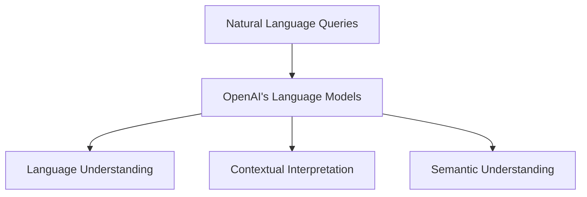
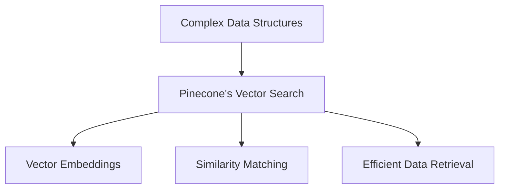
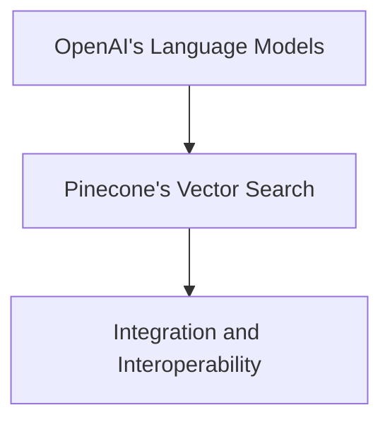

Introduction:

The OP Stack, a powerful combination of OpenAI's Language Models and Pinecone's Vector Search, revolutionizes search solutions with its advanced capabilities. In this article, we'll dive into the OP Stack and explore how it leverages the strengths of both components to deliver cutting-edge search functionality. To provide a clear understanding, we'll use Mermaid.js diagrams to visually depict the key concepts.

Diagram 1: OpenAI's Language Models

The first diagram illustrates OpenAI's Language Models, which form the foundation of the OP Stack. They process natural language queries, enabling advanced language understanding, contextual interpretation, and semantic comprehension. These models are designed to extract meaning and context from user queries, enabling accurate and precise search results.

Diagram 2: Pinecone's Vector Search

The second diagram showcases Pinecone's Vector Search, an integral part of the OP Stack. It specializes in handling complex data structures and employs vector embeddings, enabling efficient similarity matching and retrieval. With Pinecone's advanced algorithms, the OP Stack can quickly and accurately find relevant results based on vector similarity, resulting in highly accurate and personalized search experiences.

Diagram 3: Integration and Interoperability

The third diagram demonstrates the seamless integration and interoperability between OpenAI's Language Models and Pinecone's Vector Search within the OP Stack. This integration enables the efficient flow of information and data exchange between the two components, enhancing the overall search capabilities and performance.

Conclusion:
The OP Stack, combining the power of OpenAI's Language Models and Pinecone's Vector Search, presents a formidable solution for advanced search applications. OpenAI's language processing expertise, coupled with Pinecone's efficient similarity matching and retrieval mechanisms, leads to highly accurate, personalized, and context-aware search experiences.

By understanding the components of the OP Stack and how they work together, businesses can harness the full potential of AI-driven search solutions. Whether it's natural language understanding, complex data retrieval, or personalized search results, the OP Stack delivers advanced capabilities that enable organizations to revolutionize their search functionalities.

Through the visual representations provided diagrams, we have demystified the OP Stack and showcased the power it holds in transforming search experiences. By leveraging this powerful combination, businesses can gain a competitive edge by offering highly accurate, context-aware, and efficient search solutions.
