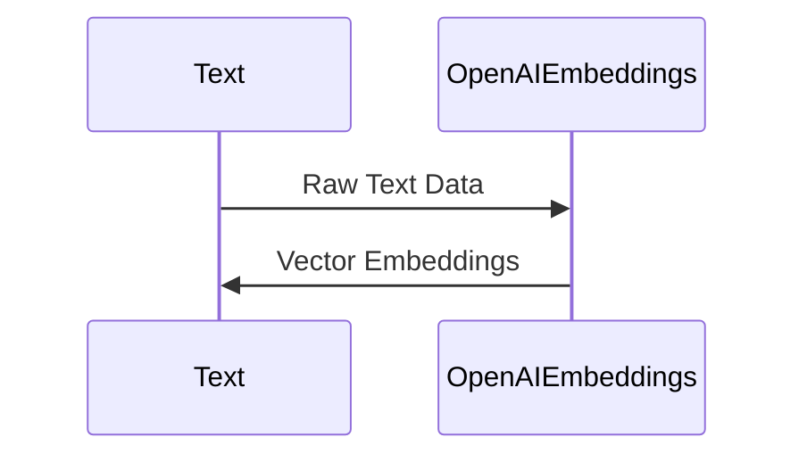
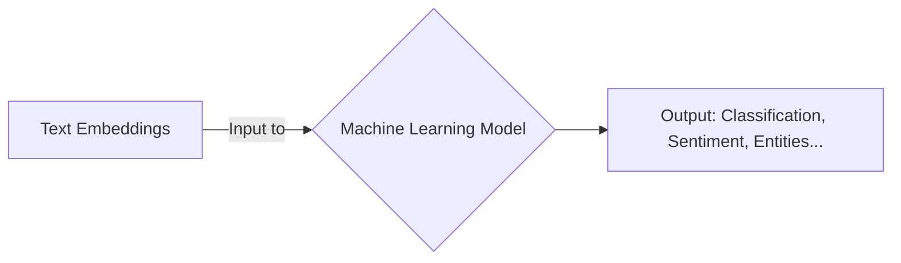

# Decoding the Magic of Text Embeddings with OpenAI

In the world of natural language processing (NLP), representing textual information in a format that a machine can understand is a fundamental challenge. This is where text embeddings come in. These are vector representations of text data that encode the semantic and syntactic nuances of the text in a way that can be processed by machine learning models.

Here's a simplistic visualization of what a text embedding might look like:

```mermaid
graph LR
A[Text: "Hello, World"] --> B{Word Embedding}
B --> C[Vector: [0.1, 0.3, 0.9...]]
```

OpenAI, a leading entity in the field of artificial intelligence, offers powerful tools for generating these text embeddings. One such tool is the GPT family of language models, which can generate meaningful vector representations of text inputs, capturing their context and semantics.

To understand how this process works, let's consider a script that calculates embeddings for a batch of text data:

```javascript
    // OpenAI embeddings for the document chunks
    const embeddings = new OpenAIEmbeddings({
      openAIApiKey: openAIapiKey as string,
    });
```

In the code snippet above, the `OpenAIEmbeddings` object from the `langchain/embeddings/openai` library is used. This library is a JavaScript wrapper for the OpenAI GPT-3 model, providing a simple API to generate text embeddings.

The `OpenAIEmbeddings` object is initialized with an OpenAI API key, which allows the script to make requests to the GPT-3 model hosted on the OpenAI servers. Once initialized, this object can be used to calculate embeddings for a batch of text data.



When the embeddings are calculated, the GPT-3 model essentially reads through the text and represents each word, phrase, or sentence as a vector in a multi-dimensional space. These vectors capture the contextual and semantic information of the text, enabling machine learning models to understand and process the textual data more effectively.

These embeddings can then be used in various NLP tasks such as text classification, sentiment analysis, named entity recognition, and more. The rich and high-dimensional embeddings generated by the GPT-3 model allow these tasks to be performed with a high level of accuracy and precision.



Overall, the ability to generate meaningful text embeddings is a powerful tool in the field of NLP. OpenAI's GPT-3 model, with its state-of-the-art performance and easy-to-use API, is an invaluable asset for any developer or data scientist working in this field.
