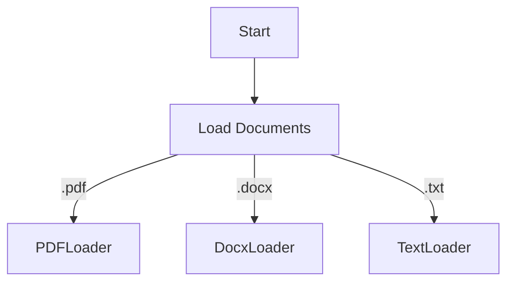
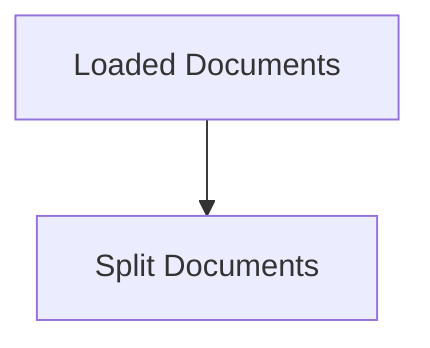
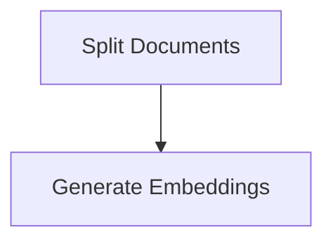
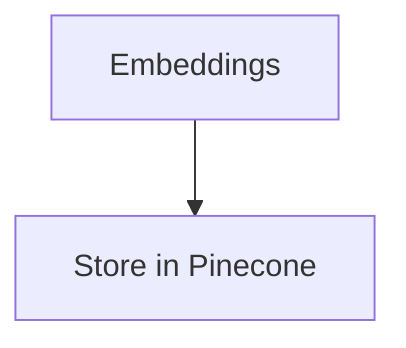
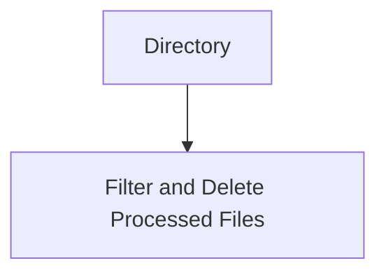

# Understanding a Text Processing Workflow with Pinecone and OpenAI Embeddings

When dealing with vast amounts of textual data, setting up an efficient pipeline for data ingestion, processing, and storage is crucial. This article presents a workflow used in the Next.js function to manage text files using multiple libraries and services. To illustrate the steps in this process, we will use a piece of example code and complement it with Mermaid.js diagrams.

Here is the example code, which implements the following operations:

- Loads documents from a specified directory
- Splits documents into smaller chunks
- Calculates embeddings for these chunks using OpenAI
- Stores the chunks and their embeddings in a Pinecone vector index
- Deletes the processed files from the directory

```javascript
/* This is a placeholder for the code you provided */
```

The process can be divided into several key steps:

### 1. Initialization

This step involves preparing the necessary parameters and configurations, such as API keys and Pinecone environment details. Additionally, it determines the filePath depending on the production environment.

### 2. Document Loading

In this step, documents of various formats (PDF, DOCX, TXT) are loaded from a specific directory using the DirectoryLoader. Depending on the file extension, an appropriate loader is used.



### 3. Document Splitting

The loaded documents are then split into smaller chunks. This is done by using a RecursiveCharacterTextSplitter. The size of the chunks and the overlap between them can be adjusted using the query parameters provided in the request.



### 4. Embedding Generation

For each document chunk, an embedding is generated using the OpenAIEmbeddings function. The OpenAI API key is used to access this service.



### 5. Storage in Pinecone

Once the embeddings are generated, the document chunks along with their embeddings are stored in Pinecone, a vector database service. The documents are stored in a specific Pinecone index, which is accessed using the provided index name.



### 6. Deletion of Processed Files

Finally, after processing, the documents in the initial directory are deleted. This is done by scanning the directory, filtering out the processed files, and removing them.



In summary, this function provides a robust, efficient, and scalable approach to processing, managing, and storing chunks of textual data, leveraging the power of OpenAI for generating meaningful embeddings and Pinecone for efficient vector storage and retrieval.

Please be aware that the described process is a single example, and the specific steps and tools may vary depending on your specific requirements and preferences.
