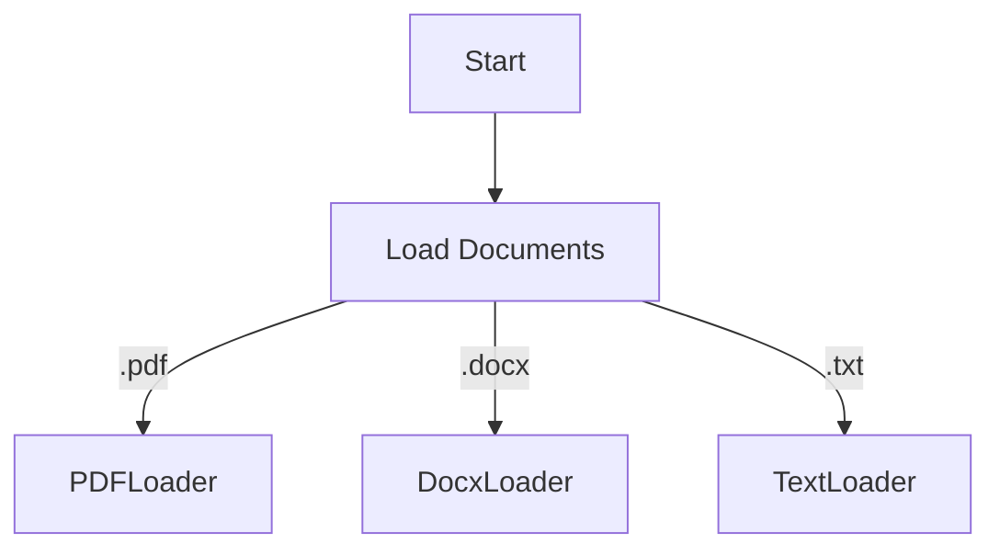
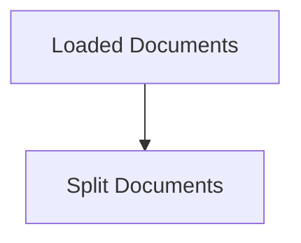
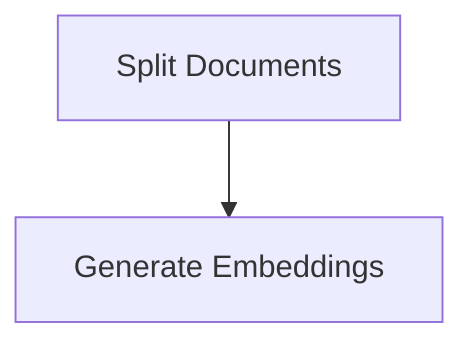
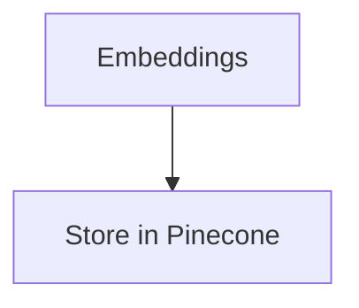
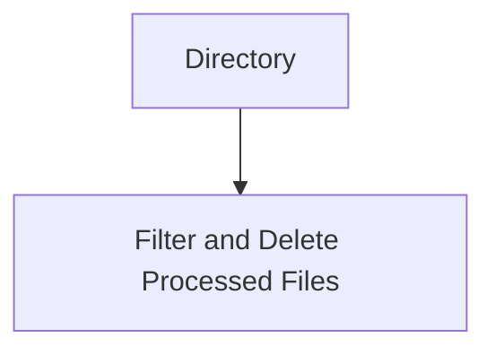

# Understanding a Text Processing Workflow with Pinecone and OpenAI Embeddings

When dealing with vast amounts of textual data, setting up an efficient pipeline for data ingestion, processing, and storage is crucial. This article presents a workflow used in the Next.js function to manage text files using multiple libraries and services. To illustrate the steps in this process, we will use a piece of example code and complement it with Mermaid.js diagrams.

Here is the example code, which implements the following operations:

- Loads documents from a specified directory
- Splits documents into smaller chunks
- Calculates embeddings for these chunks using OpenAI
- Stores the chunks and their embeddings in a Pinecone vector index
- Deletes the processed files from the directory

```ts
// Importing necessary modules from their respective locations
import { RecursiveCharacterTextSplitter } from "langchain/text_splitter"; // For splitting text into smaller chunks
import { OpenAIEmbeddings } from "langchain/embeddings/openai"; // For creating document embeddings using OpenAI
import { PineconeStore } from "langchain/vectorstores/pinecone"; // For storing document vectors in Pinecone
import { PDFLoader } from "langchain/document_loaders/fs/pdf"; // For loading PDF documents
import { DirectoryLoader } from "langchain/document_loaders/fs/directory"; // For loading documents from a directory
import { DocxLoader } from "langchain/document_loaders/fs/docx"; // For loading DOCX documents
import { TextLoader } from "langchain/document_loaders/fs/text"; // For loading text documents
import { NextApiRequest, NextApiResponse } from "next"; // Next.js API route support
import fs from "fs"; // Node.js file system module
import { initPinecone } from "@/utils/pinecone-client"; // Function to initialize Pinecone client

// Determine the file path depending on the environment
const filePath = process.env.NODE_ENV === "production" ? "/tmp" : "tmp"; // Path for storing files

// Define the async function to handle the request and response of the Next.js API route
export default async function handler(
  req: NextApiRequest,
  res: NextApiResponse
) {
  // Extract API keys and other necessary headers from the request
  const openAIapiKey = req.headers["x-openai-key"];
  const pineconeApiKey = req.headers["x-pinecone-key"];
  const targetIndex = req.headers["x-index-name"] as string;
  const pineconeEnvironment = req.headers["x-environment"];

  // Initialize the Pinecone client
  const pinecone = await initPinecone(
    pineconeApiKey as string,
    pineconeEnvironment as string
  );

  // Extract necessary parameters from the query string of the request
  const { namespaceName, chunkSize, overlapSize } = req.query;

  try {
    // Initialize a new DirectoryLoader with handlers for PDF, DOCX, and TXT files
    const directoryLoader = new DirectoryLoader(filePath, {
      ".pdf": (path) => new PDFLoader(path),
      ".docx": (path) => new DocxLoader(path),
      ".txt": (path) => new TextLoader(path),
    });

    // Load documents using the DirectoryLoader
    const rawDocs = await directoryLoader.load();

    // Initialize a new RecursiveCharacterTextSplitter with given parameters
    const textSplitter = new RecursiveCharacterTextSplitter({
      chunkSize: Number(chunkSize),
      chunkOverlap: Number(overlapSize),
    });

    // Split documents into smaller chunks
    const docs = await textSplitter.splitDocuments(rawDocs);

    // Initialize a new OpenAIEmbeddings with the OpenAI API key
    const embeddings = new OpenAIEmbeddings({
      openAIApiKey: openAIapiKey as string,
    });

    // Get the Pinecone index with the given name
    const index = pinecone.Index(targetIndex);

    // Store the document chunks in Pinecone with their embeddings
    await PineconeStore.fromDocuments(docs, embeddings, {
      pineconeIndex: index,
      namespace: namespaceName as string,
      textKey: "text",
    });

    // Read the file directory and filter out PDF, DOCX, and TXT files
    const filesToDelete = fs
      .readdirSync(filePath)
      .filter(
        (file) =>
          file.endsWith(".pdf") ||
          file.endsWith(".docx") ||
          file.endsWith(".txt")
      );

    // Delete the PDF, DOCX and TXT files
    filesToDelete.forEach((file) => {
      fs.unlinkSync(`${filePath}/${file}`);
    });

    // Send a successful response with a message
    res.status(200).json({ message: "Data ingestion complete" });
  } catch (error) {
    // Log the error and send a failure response if something goes wrong
    console.log("error", error);
    res.status(500).json({ error: "Failed to ingest your data" });
  }
}
```

The process can be divided into several key steps:

### 1. Initialization

This step involves preparing the necessary parameters and configurations, such as API keys and Pinecone environment details. Additionally, it determines the filePath depending on the production environment.

### 2. Document Loading

In this step, documents of various formats (PDF, DOCX, TXT) are loaded from a specific directory using the DirectoryLoader. Depending on the file extension, an appropriate loader is used.



### 3. Document Splitting

The loaded documents are then split into smaller chunks. This is done by using a RecursiveCharacterTextSplitter. The size of the chunks and the overlap between them can be adjusted using the query parameters provided in the request.



### 4. Embedding Generation

For each document chunk, an embedding is generated using the OpenAIEmbeddings function. The OpenAI API key is used to access this service.



### 5. Storage in Pinecone

Once the embeddings are generated, the document chunks along with their embeddings are stored in Pinecone, a vector database service. The documents are stored in a specific Pinecone index, which is accessed using the provided index name.



### 6. Deletion of Processed Files

Finally, after processing, the documents in the initial directory are deleted. This is done by scanning the directory, filtering out the processed files, and removing them.



In summary, this function provides a robust, efficient, and scalable approach to processing, managing, and storing chunks of textual data, leveraging the power of OpenAI for generating meaningful embeddings and Pinecone for efficient vector storage and retrieval.

Please be aware that the described process is a single example, and the specific steps and tools may vary depending on your specific requirements and preferences.
