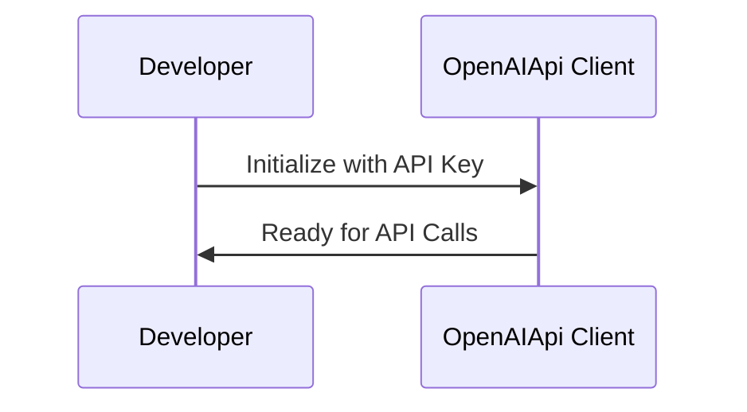
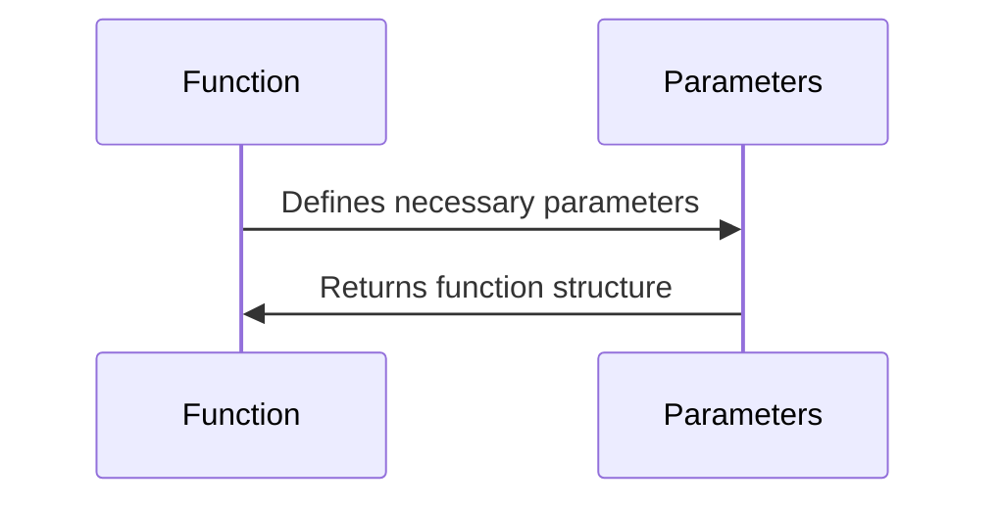
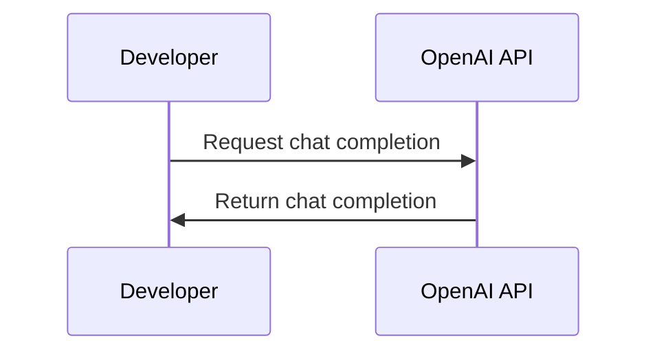
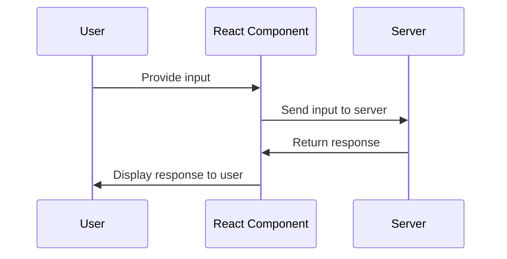

# Enhancing Interactive Applications with Function Calling in OpenAI's GPT Models: A Deep Dive into React Integration with Vercel AI SDK

OpenAI's GPT models have the capability to make function calls, which can be utilized in creating powerful and interactive chat interfaces. The integration of Vercel AI SDK with OpenAI's GPT models simplifies the task of creating such a user-friendly chat interface.

## Setting up the OpenAI API Client

The first step involves setting up the OpenAI API client and defining the functions that the chat model can call. The below diagram provides a graphical illustration of this process.



Here's the corresponding code:

```javascript
import { Configuration, OpenAIApi } from "openai-edge";

// Configure the OpenAI API client with your OpenAI API key.
const config = new Configuration({
  apiKey: process.env.OPENAI_API_KEY,
});
const openai = new OpenAIApi(config);
```

## Defining Function Calls

Next, we define the set of function calls that our chat model can use.



The corresponding code looks something like this:

```javascript
const functions: ChatCompletionFunctions[] = [
  {
    // The function for getting the current weather.
    name: "get_current_weather",
    description: "Get the current weather",
    parameters: {
      type: "object",
      properties: {
        location: {
          type: "string",
          description: "The city and state, e.g. San Francisco, CA",
        },
        format: {
          type: "string",
          enum: ["celsius", "fahrenheit"],
          description:
            "The temperature unit to use. Infer this from the users location.",
        },
      },
      required: ["location", "format"],
    },
  },
  // Other functions...
];
```

## Chat Completion with OpenAI API

With the client and function calls set up, we can create chat completions with the OpenAI API.



Here's the corresponding code:

```javascript
export async function POST(req: Request) {
  // Extract the messages and the function_call from the request body.
  const { messages, function_call } = await req.json();

  // Create a chat completion using the OpenAI API.
  const response = await openai.createChatCompletion({
    model: "gpt-3.5-turbo",
    stream: true,
    messages,
    functions,
    function_call,
  });

  // Convert the response into a stream and return it.
  const stream = OpenAIStream(response);
  return new StreamingTextResponse(stream);
}
```

## Client-side Chat Interface

Finally, we create a React component for our chat interface, using the `useChat` hook from the Vercel AI SDK.



Here's the corresponding code:

```javascript
"use client";

import { useChat, Message } from "ai/react";
import { ChatRequest, FunctionCallHandler, nanoid } from "ai";

export default function Chat() {
  // Define a function call handler.
  const functionCallHandler: FunctionCallHandler = async (
    chatMessages,
    functionCall
  ) => {
    // Handle the function calls as required.
  };

  // Use the useChat hook to handle chat operations.
  const { messages, input, handleInputChange, handleSubmit } = useChat({
    api: "/api/chat-with-functions",
    experimental_onFunctionCall: functionCallHandler,
  });

  // The remaining code here is to render your chat interface using the messages and user input handling.
}
```

The combination of Vercel AI SDK and OpenAI's GPT models provides a powerful toolkit to build interactive applications. You can further extend this basic structure with additional function calls and features to meet your specific needs, thereby creating a highly engaging user experience.
