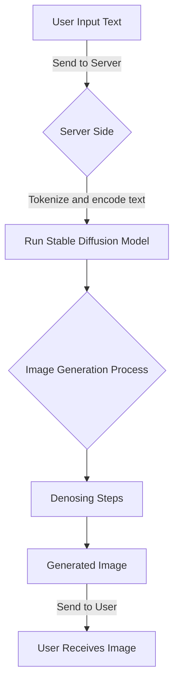
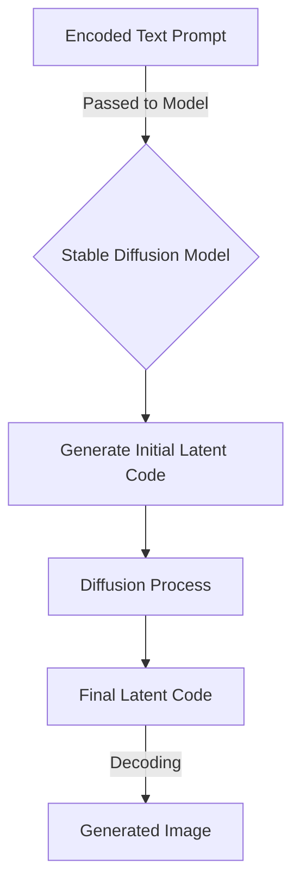

# Building a Text-to-Image Application with the Stable Diffusion Model on Replicate using Next.js

In this guide, we'll be using the Stable Diffusion model from Replicate to create a web application with Next.js. This application will take text inputs and transform them into photo-realistic images. By the end of this tutorial, you'll have a live website where you can input any text and see it turned into an image.

The complete project repository can be accessed from [here](https://github.com/replicate/getting-started-nextjs).

## Workflow Diagram

Here's a diagram that outlines the basic workflow of our application.

In this diagram:

1. `User Input Text`: The user inputs a text prompt into the web application.
2. `Send to Server`: This input is sent to the server.
3. `Server Side`: The server receives the input.
4. `Tokenize and encode text`: The server tokenizes and encodes the text input.
5. `Run Stable Diffusion Model`: The server runs the Stable Diffusion model using the encoded text input.
6. `Image Generation Process`: The model begins the process of generating an image from the encoded text.
7. `Denoising Steps`: The model applies a number of denoising steps to refine the generated image.
8. `Generated Image`: The final image is generated.
9. `Send to User`: The generated image is sent back to the user.
10. `User Receives Image`: The user receives the generated image.

This is a simplified representation of the application workflow. The actual implementation may involve more complex steps.

## Stable Diffusion Process

Let's now focus on the `Stable Diffusion Model` process itself:

In this diagram:

1. `Encoded Text Prompt`: The tokenized and encoded text prompt is received by the Stable Diffusion model.
2. `Stable Diffusion Model`: The model begins the image generation process.
3. `Generate Initial Latent Code`: An initial latent code is generated from the encoded text prompt.
4. `Diffusion Process`: The initial latent code undergoes a diffusion process to refine the code.
5. `Final Latent Code`: After several iterations, the final latent code is obtained.
6. `Decoding`: The final latent code is decoded to produce the generated image.

Again, this is a simplified representation. The actual Stable Diffusion process involves complex and iterative steps to generate the final image from the encoded text prompt.

## Prerequisites

To start, ensure you have:

1. Node.js installed for running your application locally. Node.js can be installed from [nodejs.org](https://nodejs.org).
2. An account on [Replicate](https://replicate.com/) for running machine learning models. It's free to get started, and you receive some credit upon signing up. Any usage beyond the free credit is billed per second.
3. An account on [GitHub](https://github.com/) for hosting your application's source code.
4. An account on [Vercel](https://vercel.com/), a platform for hosting Next.js apps. This is where you'll deploy your web application.

## Resources

- [GitHub Repository](https://github.com/stability-ai/stable-diffusion)
- [Paper](https://openaccess.thecvf.com/content/CVPR2022/html/Rombach_High-Resolution_Image_Synthesis_With_Latent_Diffusion_Models_CVPR_2022_paper.html)

## Licensing

The Stable Diffusion model utilizes the CreativeML OpenRAIL M license, adapted from the work conducted by BigScience and the RAIL Initiative in the field of responsible AI licensing.
