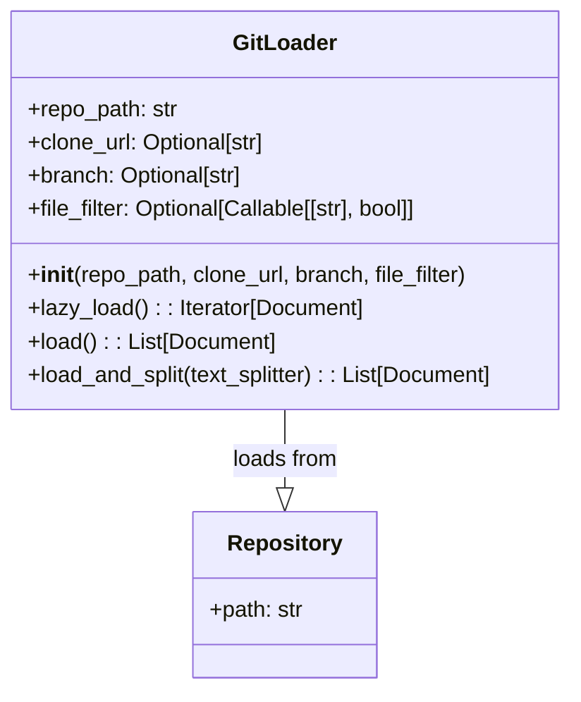
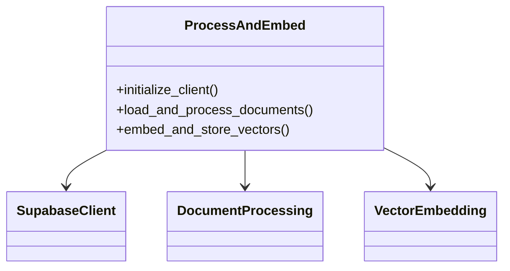
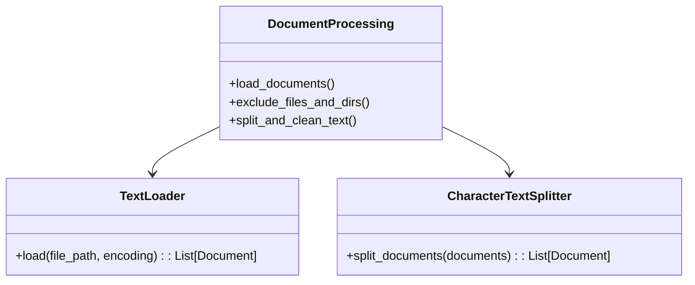
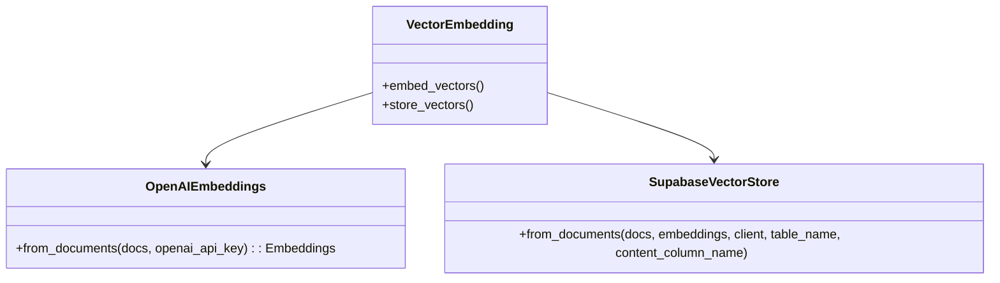
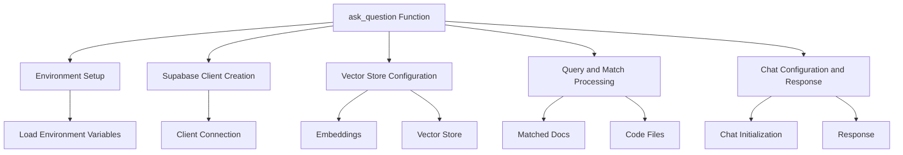
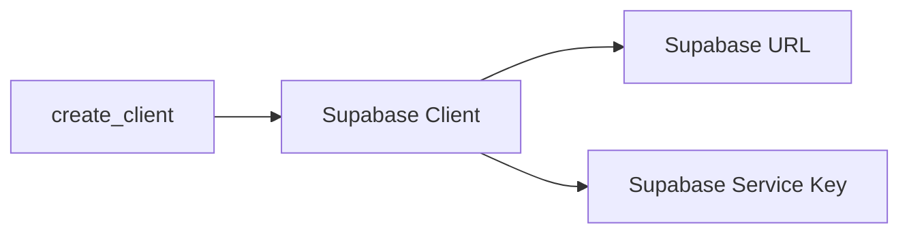
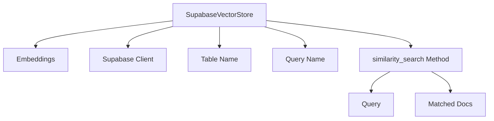
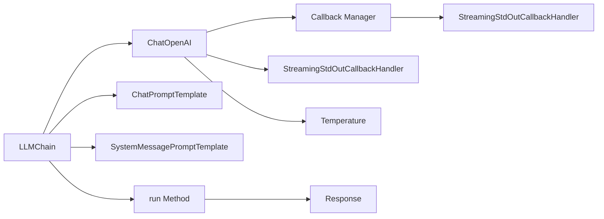

### Introduction

In the age of AI-driven development and cloud computing, building a GitHub Chat using OpenAI, Supabase with pgVector, and LangChain symbolizes the merging of cutting-edge technologies. In this article, we'll explore the integration of these tools, focusing particularly on LangChain's innovative GitLoader component.

#### LangChain's GitLoader: A Comprehensive Tool for Managing Git Repositories

LangChain, as a part of this solution, provides specialized components designed to work with text documents. Among these, the GitLoader stands out as an essential tool for managing Git repositories.

##### Functionality

- **Loading Repositories:** GitLoader can load files from a local Git repository or clone them from a remote URL.
- **Branch Selection:** It allows the user to specify the branch to load files from, defaulting to the main branch.
- **File Filtering:** An optional parameter lets the user define a function to decide whether to load a particular file.
- **Document Handling:** Several methods, such as load, lazy_load, and load_and_split, facilitate various ways of working with documents in the repository.

Here's a Mermaid.js diagram representing these functionalities:



This diagram shows the GitLoader class and its association with a general Repository class, illustrating how GitLoader interacts with the repositories.

LangChain's GitLoader is a comprehensive tool that simplifies the process of working with Git repositories. Its extensive functionalities and well-designed API make it a valuable asset for developers working with text files in repositories. With clear methods for initialization and file handling, it is a powerful part of the LangChain library, reflecting the broader trends in text processing and management in modern software development.

#### Processing and Embedding Documents with OpenAI and Supabase

Below are diagrams representing the process of loading, processing, embedding, and storing documents using various components, including OpenAI embeddings and Supabase.

##### Processing and Embedding



##### Document Processing



##### Vector Embedding and Storage



---

This article provides insights into the novel integration of OpenAI, Supabase, LangChain, and other technologies to craft a complex GitHub Chat system. By leveraging these cutting-edge tools, developers can harness the power of AI and cloud computing to create intelligent and scalable applications.









```

```
