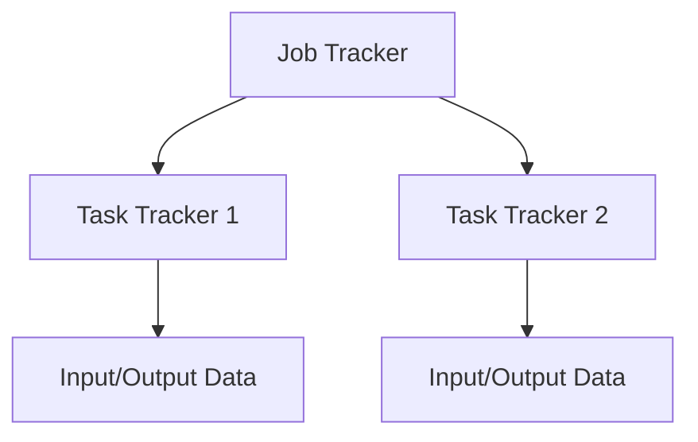
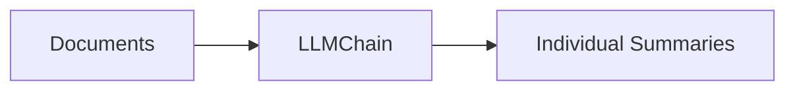
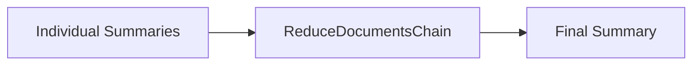
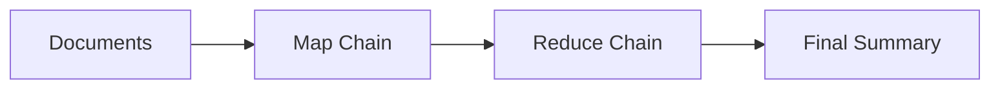

### Introduction

In the era of big data, handling vast amounts of information efficiently is a significant challenge. Map-Reduce, a programming model and processing technique, provides a solution to this challenge, allowing massive datasets to be processed in parallel across a distributed cluster. This article will further explore the Map-Reduce approach for document summarization, leveraging Large Language Models (LLMs) with LangChain.

### Map-Reduce Basics

Map-Reduce consists of two primary functions:

- **Map Function:** Converts a set of data into intermediate key/value pairs.
- **Reduce Function:** Merges all intermediate values associated with the same key.

### Architecture of Map-Reduce

The architecture of Map-Reduce involves several components like Job Tracker, Task Trackers, and Input/Output Data, and can be represented as follows:



### Applications of Map-Reduce

Map-Reduce has various applications in big data processing, including search engines, data analytics, and machine learning.

## Map-Reduce Approach for Document Summarization with LangChain

Map-Reduce is used in processing and generating big data. In document summarization, the approach is divided into mapping individual documents to summaries and reducing those summaries into a consolidated summary.

### Mapping Stage

The map stage takes documents and transforms them into individual summaries using LLM:



### Reducing Stage

The reduce stage combines individual summaries into a final summary:



### Combining Map and Reduce Chains

The complete Map-Reduce process combines the mapping and reducing stages:



### Example Flask API for Map-Reduce Document Summarization

You can build an API using Flask to enable the Map-Reduce document summarization functionality. Here's a practical example that summarizes YouTube videos using LangChain and the Map-Reduce approach:

```python
from flask import Flask, request, jsonify
from langchain.document_loaders import YoutubeLoader
from langchain.chat_models import ChatOpenAI
from langchain.text_splitter import CharacterTextSplitter
from langchain.chains.Map-Reduce import MapReduceDocumentsChain
from langchain.prompts import PromptTemplate
from langchain.chains import StuffDocumentsChain, LLMChain, ReduceDocumentsChain
from langchain.chains.combine_documents.stuff import StuffDocumentsChain
import logging

logging.basicConfig(level=logging.INFO)
logger = logging.getLogger(__name__)

app = Flask(__name__)

llm = ChatOpenAI(temperature=0)

# Map
map_template = """The following is a set of documents
{docs}
Based on this list of docs, please identify the main themes
Helpful Answer:"""
map_prompt = PromptTemplate.from_template(map_template)
map_chain = LLMChain(llm=llm, prompt=map_prompt)

# Reduce
reduce_template = """The following is set of summaries:
{doc_summaries}
Take these and distill it into a final, consolidated summary of the main themes.
Helpful Answer:"""
reduce_prompt = PromptTemplate.from_template(reduce_template)
reduce_chain = LLMChain(llm=llm, prompt=reduce_prompt)

# Combine documents chain
combine_documents_chain = StuffDocumentsChain(
    llm_chain=reduce_chain, document_variable_name="doc_summaries"
)

# Reduce documents chain
reduce_documents_chain = ReduceDocumentsChain(
    combine_documents_chain=combine_documents_chain,
    collapse_documents_chain=combine_documents_chain,
    token_max=4000,
)

# Map-Reduce documents chain
map_reduce_chain = MapReduceDocumentsChain(
    llm_chain=map_chain,
    reduce_documents_chain=reduce_documents_chain,
    document_variable_name="docs",
    return_intermediate_steps=False,
)

text_splitter = CharacterTextSplitter.from_tiktoken_encoder(
    chunk_size=1000, chunk_overlap=0
)

def get_transcript(video_url):
    # ... code for getting a transcript from a YouTube video ...

@app.route("/api/transcript", methods=["POST"])
def retrieve_transcript():
    video_url = request.json.get("video_url")
    # ... handling the video URL and returning the transcript ...

if __name__ == "__main__":
    app.run()
```

## Conclusion

Map-Reduce revolutionized large-scale data processing by providing a parallel processing framework. The Map-Reduce approach, especially when applied to document summarization with Large Language Models and LangChain, provides a flexible and effective way to synthesize complex information into concise summaries.
