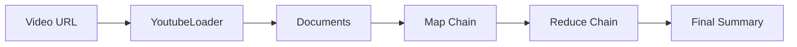

### Introduction

With the growth of video content on platforms like YouTube, summarizing videos has become a prominent challenge.

In our [previous article](https://openai-beyond.com/understanding-map-reduce-for-document-summarization-with-langchain), we explored the concept of MapReduce and how it can be applied to process and analyze large datasets. Continuing from that, let's look at a specific implementation using the LangChain library.

One of the key components of our code example is the `YoutubeLoader` class from LangChain. This class enables us to load YouTube video transcripts into our application:

```python
from flask import Flask, request, jsonify
+ from langchain.document_loaders import YoutubeLoader

from langchain.chat_models import ChatOpenAI
from langchain.text_splitter import CharacterTextSplitter
from langchain.chains.mapreduce import MapReduceDocumentsChain
from langchain.prompts import PromptTemplate
from langchain.chains import StuffDocumentsChain, LLMChain, ReduceDocumentsChain

# ...

# Function to get a transcript from a given YouTube video URL
def get_transcript(video_url):
    logger.info(f"Loading video from URL: {video_url}")
+   loader = YoutubeLoader.from_youtube_url(video_url, add_video_info=True)
+   documents = loader.load()
    logger.info(f"Documents loaded: {documents}")

# ...

```

### Integration of YoutubeLoader

The following diagram shows how the `YoutubeLoader` is used to load documents from YouTube and pass them through the Map-Reduce process.



In this flow:

- The `YoutubeLoader` receives a video URL and loads the documents associated with the video.
- The loaded documents are then processed through the Map-Reduce chain to generate a final summary.

The YoutubeLoader seamlessly integrates into the existing architecture, allowing the summarization process to include content from YouTube videos. By using the YoutubeLoader, you can extend the application to handle various types of data sources, including video content, thereby enriching the document summarization capabilities.
