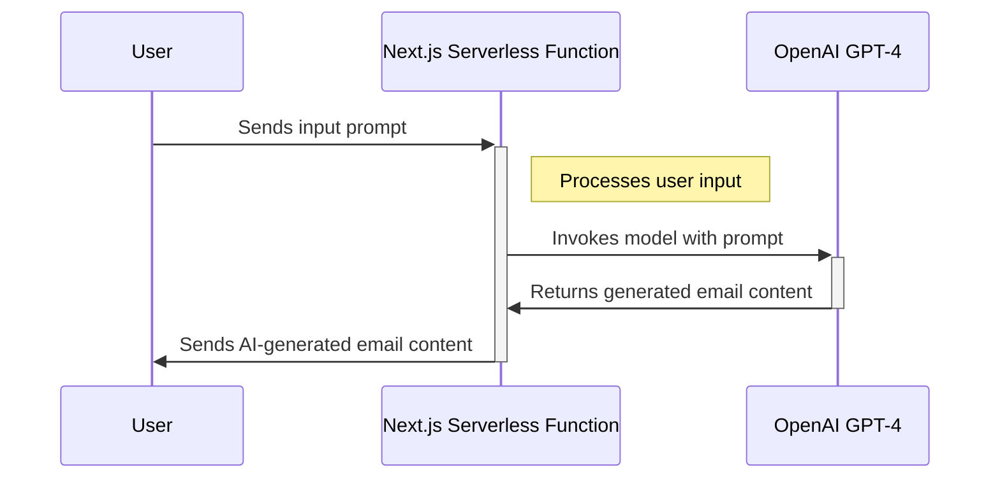
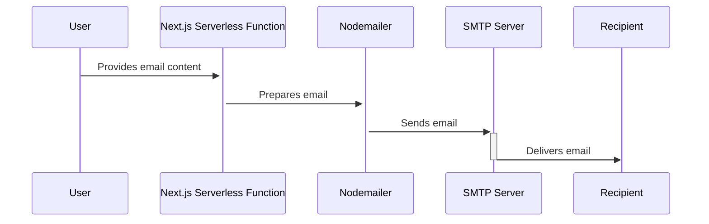

# Building an AI-Powered Email Composer with Next.js and GPT-4

As a software engineer and tech enthusiast, I've always been fascinated by the power of artificial intelligence and its applications in our daily lives. Recently, I embarked on a project to create an AI-powered email composer, and I'd like to share my journey and the technologies I used to bring this idea to life.

### The Inspiration

The concept was simple yet powerful: an email composer that leverages the capabilities of OpenAI's GPT-4 to assist users in drafting emails. The idea struck me as I was pondering over ways to streamline my daily tasks, and email composition was one that stood out. With the rise of AI-powered tools, why not create one that could compose emails?

### The Tech Stack

For this project, I decided to use Next.js for its serverless functions and easy deployment. The serverless function would act as an intermediary between the user interface and the AI model, processing user input and returning the AI-generated email content.

### The Implementation

Here's a high-level overview of how the email composer works, represented in a Mermaid.js sequence diagram:

1. **User Input**: The user provides a prompt or context for the email they want to compose.
2. **Next.js Serverless Function**: A POST request is made to a Next.js serverless function with the user input.
3. **AI Model Invocation**: The serverless function invokes OpenAI's GPT-4 using the provided prompt.
4. **Email Generation**: GPT-4 processes the input and generates a draft email based on the context.
5. **Output Formatting**: The output is formatted to ensure it matches the structure of an email, with a subject and body.
6. **Response**: The serverless function sends back the AI-generated email content to the user interface.

### Sending the Email

Once the email content is generated, it's crucial to have a reliable way to send the email to the intended recipient. For this, I utilized Nodemailer, a module for Node.js applications to allow easy email sending. Here's the process, represented in another Mermaid.js sequence diagram:

### Challenges and Learnings

Building the email composer wasn't without its challenges. Ensuring the AI model understood the context and formatted the email correctly required fine-tuning the prompt and output formatting. I also had to ensure the serverless function was optimized for performance.

### Conclusion

The AI-powered email composer is a testament to the capabilities of AI in enhancing productivity. It's a tool that demonstrates the potential of GPT-4 and Next.js when used in harmony. As I continue to refine and improve it, I'm excited to explore further applications of AI in our daily workflows.

---

This article incorporates Mermaid.js diagrams to visually explain the processes involved in the email composer. Adjust the diagrams as needed based on your actual implementation, and feel free to add more details or diagrams to enrich the article.
