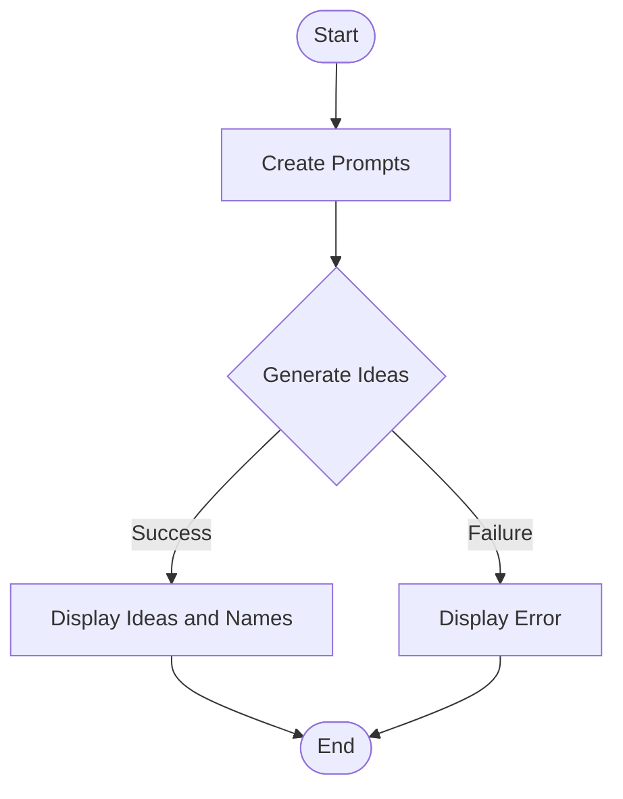
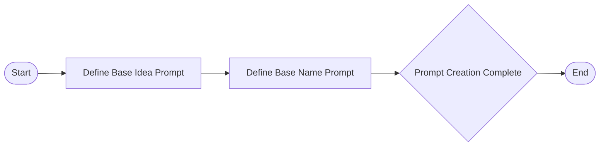

Brainstorming new ideas is a lot harder when starting with a blank canvas.
It helps to begin with some seed ideas, which you can then use to iterate and develop into viable candidates that could meet your goals.
One example where this can be useful is in generating startup ideas.
A few seed ideas can help aspiring founders brainstorm the next big thing that they are going to build.

This article provides an overview of building a Startup Idea Generator app, which is based on the Python version available in the [Cohere documentation](https://docs.cohere.com/page/startup-idea-generator).

The source code for this project can be found on GitHub at [nicolad/openai-kitchen-sink](https://github.com/nicolad/openai-kitchen-sink/tree/main/apps/startup-idea-generator).

A live version of the app is deployed on Vercel and can be accessed here: [Startup Idea Generator App](https://startup-idea-generator-cohere.vercel.app/).

## App Workflow Diagram

## Prompt Creation Process

These diagrams visually represent the steps involved in building the Startup Idea Generator app, from creating prompts to enhancing user interactivity.

To get started building your own version of the Startup Idea Generator app, create a free Cohere account and explore the power of AI in generating innovative startup ideas and names.

---

This updated article includes the mermaid.js diagrams that illustrate the workflow of building the Startup Idea Generator app and references to the original Python version and the source code repository.
