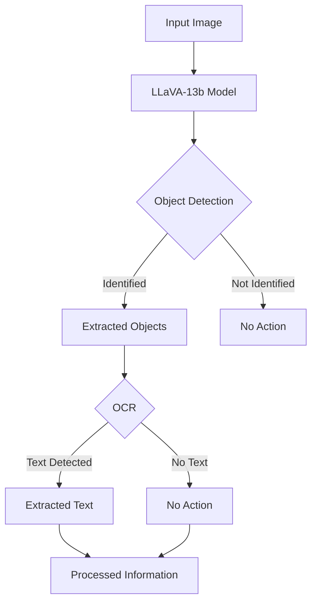

The integration of Object Detection and Optical Character Recognition (OCR) with large language and vision models like LLaVA-13b represents a significant leap forward in the field of computer vision and natural language processing. In this article, we'll explore how LLaVA-13b, a model that mimics the multimodal capabilities of GPT-4, can be utilized for advanced visual and language understanding tasks.

## Introduction to LLaVA-13b

LLaVA-13b is an end-to-end trained large multimodal model that combines a vision encoder with Vicuna for general-purpose visual and language understanding. It has set a new state-of-the-art accuracy on Science QA, demonstrating impressive chat capabilities. For more information, visit the [LLaVA project page](https://llava-vl.github.io/).

## Model Deployment and Usage

LLaVA-13b is accessible via Replicate, a platform that allows users to deploy and run models.
Users can interact with the model using the [Replicate API](https://replicate.com/yorickvp/llava-13b), and the source code for the project is available on [GitHub](https://github.com/nicolad/openai-kitchen-sink/tree/main/apps/llava).
The live app is available [here](https://llava-13b.vercel.app/).

## Object Detection and OCR Workflow

In this workflow:

- The input image is fed into the LLaVA-13b model.
- Object detection is performed to identify objects within the image.
- Identified objects are extracted for further analysis.
- OCR is applied to the extracted objects to detect and extract text.
- The processed information is then available for various applications, such as chatbots, search engines, and more.

## Conclusion

LLaVA-13b's integration with object detection and OCR technologies opens up a myriad of possibilities for applications requiring sophisticated visual and language understanding. Its deployment on platforms like Replicate makes it accessible to developers and researchers aiming to leverage its capabilities for innovative projects.

For those interested in exploring LLaVA-13b further, visit the [LLaVA project page](https://llava-vl.github.io/), the [Replicate API page](https://replicate.com/yorickvp/llava-13b), and the [GitHub repository](https://github.com/replicate/llama-chat).
